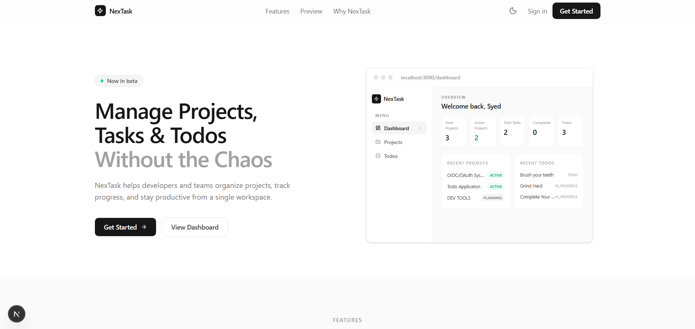
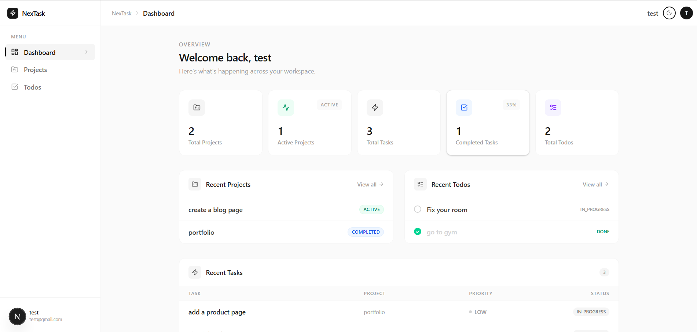
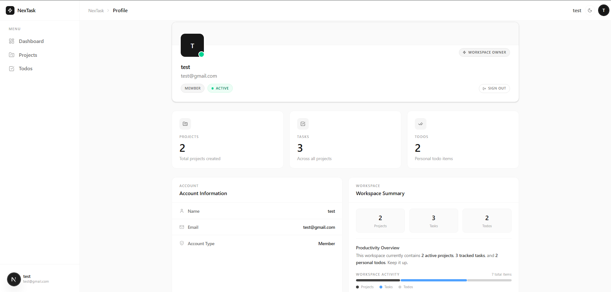

# NexTask

A modern full-stack project and task management platform built with Next.js.

NexTask helps users manage projects, track tasks, and organize personal todos from a single dashboard while keeping all data securely isolated per user.

## Features

* Secure authentication with Auth.js
* Project management
* Task management with priorities and status tracking
* Personal todo management
* User dashboard with workspace statistics
* User profile page
* Dark mode support
* Responsive design
* Protected routes and user-specific data access

## Screenshots

### Landing Page



### Dashboard



### Profile



## Tech Stack

* Next.js 16
* React 19
* TypeScript
* Tailwind CSS
* Auth.js (NextAuth v5)
* PostgreSQL (Neon)
* Prisma ORM
* Zod

## Architecture

```text
User
 │
 ├── Projects
 │     └── Tasks
 │
 └── Todos
```

## Getting Started

### Prerequisites

- Node.js 22+ or Bun
- PostgreSQL database
- Neon account (recommended)

### Installation

Clone the repository:

```bash
git clone <repository-url>
cd nextask
```

Install dependencies:

```bash
bun install
```

Create a `.env` file:

```env
DATABASE_URL=
AUTH_SECRET=
AUTH_URL=http://localhost:3000
```

Generate Prisma Client:

```bash
bunx prisma generate
```

Run migrations:

```bash
bunx prisma migrate dev
```

Start the development server:

```bash
bun run dev
```

Open:

```text
http://localhost:3000
```

## Database

Open Prisma Studio:

```bash
bunx prisma studio
```

This launches a local UI where you can view and edit Users, Projects, Tasks, and Todos.

## Deployment

* Frontend: Vercel
* Database: Neon PostgreSQL
* Authentication: Auth.js


